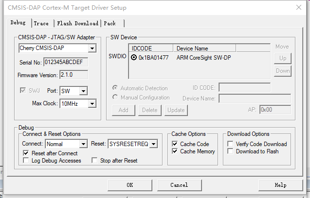
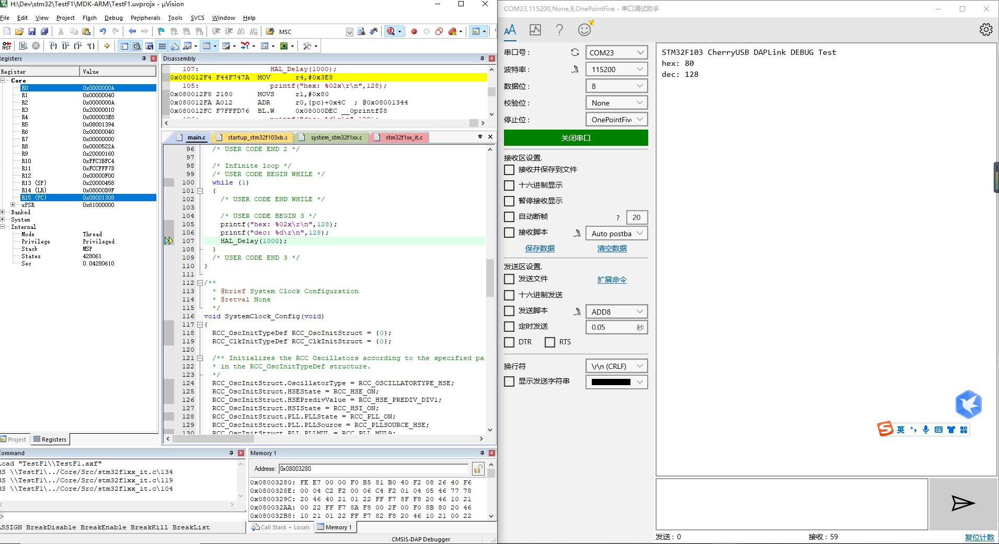

# Ch582 DAPLink

A CMSIS-DAP compliant debugger based on Ch582

## Features

* CMSIS-DAP V2.1
* SWD
* JTAG
* UART
* Connected & Running LED

## Usage

| Function | Label | GPIO |
|:-|:-:|:-:|
| JTAG_TDI | TDI | A0 |
| JTAG_TDO | TDO | A1 |
| JTAG_TMS | TMS  | A2 |
| JTAG_TCK | TCK  | A15 |
| SWD_SWDIO | TMS | A2 |
| SWD_SWCLK | TCK | A15 |
| nRESET | RTS | A4 |
| UART TX | TX | B7 |
| UART RX | RX | B4 |

Notice that 3.3V level I/O is required.

## Compile and download
First clone the project, then use MounRiver Studio to compile and download it to the target board

## Clone
```

git clone https://github.com/HaiMianBBao/CherryUSB-CH58x-DAPLink.git
cd CherryUSB-CH58x-DAPLink
git submodule update --init --recursive


```

## Renderings


